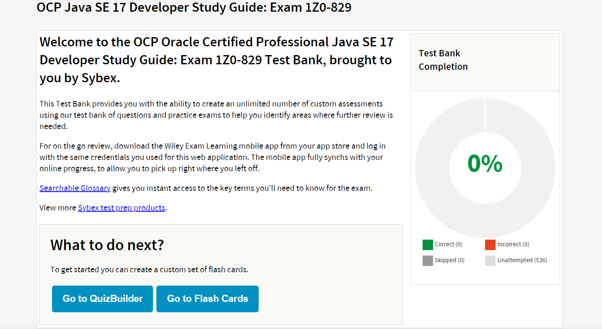

# Oracle Certified Professional: Java SE 17 Developer Certification Exam

Welcome to the OCP 17 (1Z0-829) Certification Preparation repository! This repository is designed to help you prepare
for the Oracle Certified Professional: Java SE 17 Developer (1Z0-829) certification exam. Here, you will find a
comprehensive collection of study materials, practice exercises, and resources to guide you through the exam topics and
ensure your success.

## Table of Contents

- [Introduction](#introduction)
- [Exam Overview](#exam-overview)
- [Study Materials and Resources](#study-materials-and-resources)
- [Contributing](#contributing)
- [License](#license)
- [Contact](#contact)

## Introduction

The Oracle Certified Professional: Java SE 17 Developer certification (1Z0-829) is designed for experienced Java
developers who want to demonstrate their proficiency in the Java programming language and related technologies. This
repository provides everything you need to effectively prepare for the exam, including topic breakdowns, detailed
explanations, code samples, and mock exams.

## Exam Overview

The exam tests your knowledge and skills in the following areas:

1. **Java Language and Syntax**
    - Understanding Java language features
    - Implementing object-oriented programming concepts
2. **Java Class Design**
    - Designing classes and interfaces
    - Using inheritance and polymorphism
3. **Generics and Collections**
    - Implementing generics
    - Using Java collections framework
4. **Functional Programming**
    - Using lambda expressions and functional interfaces
    - Applying Streams API
5. **Exceptions and Assertions**
    - Handling exceptions
    - Using assertions
6. **Modules**
    - Understanding Java module system
    - Creating and using modules
7. **Concurrency**
    - Implementing multithreading and concurrency
    - Using synchronization and locks
8. **I/O (Input/Output)**
    - Working with file I/O
    - Using streams and readers/writers
9. **JDBC (Java Database Connectivity)**
    - Connecting to databases using JDBC
    - Executing SQL queries and transactions
10. **Localization**
    - Implementing localization and internationalization

## Study Materials and Resources

To get started with the preparation:

### Books

* [OCP Oracle® Certified Professional Java SE 17 Developer Study Guide Exam 1Z0-829](https://www.amazon.com/Oracle-Certified-Professional-Developer-Study/dp/1119864585) -
  **Required**
* [OCP Oracle® Certified Professional Java SE 17 Developer Study Guide Exam 1Z0-829 - E-BOOK](https://www.wiley.com/en-ie/OCP+Oracle+Certified+Professional+Java+SE+17+Developer+Study+Guide%3A+Exam+1Z0-829-p-9781119864592)
* [Oracle® Certified Professional Java SE 17 Developer Practice Tests EXAM 1Z0-829](https://www.amazon.com/Oracle-Certified-Professional-Developer-Practice/dp/1119864615) -
  **Optional**

In [OCP Oracle® Certified Professional Java SE 17 Developer Study Guide Exam 1Z0-829](https://www.amazon.com/Oracle-Certified-Professional-Developer-Study/dp/1119864585)
you can find a link
to [Interactive Online Learning Environment and Test Bank](https://books.wiley.com/series/sybex-test-prep-and-certification/).
It is totally worth it. You have it for free with the book. Choose your product, activate it through an easy question
that only the owner of the book can answer. After that, you will receive an activation PIN. Just create an account (use
the email where you received the activation pin). After you complete the necessary steps for activation, you will be
able to access the test bank and more!
After you to the neccessary steps for activation you will be able to get to the test bank and more!

### Mock tests

* [OCP Java 17 Certification 1Z0-829 Practice Tests](https://enthuware.com/java-certification-mock-exams/oracle-certified-professional/ocp-java-17-exam-1z0-829) -
  **Required**

### Videos

* [Oreilly® - Simon Roberts](https://www.oreilly.com/videos/java-se-17/9780138194796/) - The best option I found based
  on reviews is paid (10 days trial - $49/month).
* [Java 17 Masterclass - Tim Buchalka](https://www.udemy.com/course/java-the-complete-java-developer-course/) - One of
  the best Java courses out there (I learned Java basics from it) - Bought it for like $15
* [Java 21, Java 17, Java 11, Java 8 (advanced) and Spring Boot](https://www.udemy.com/course/ocp11_from_oca8) - Master
  the latest topics; get Oracle OCP Certification (1Z0-829,1Z0-819,1Z0-809) and code a Spring Boot application - Bought
  it for like $15

### Links

* [Oracle web](https://education.oracle.com/java-se-17-developer/pexam_1Z0-829)
* [Oracle docs](https://docs.oracle.com/en/java/javase/17/docs/api/)
* [How I passed both the Oracle 1Z0–819 and 1Z0–829 exams](https://medium.com/@carla.debeer.uk/oracle-certified-professional-java-se-11-developer-4f8b3202870a)
* [The explained journey to being a Java 17 (1Z0–829) certified](https://medium.com/wearewaes/all-you-need-to-know-on-how-to-become-an-ocp-java-se-17-developer-918d3ebd60d2)
* [Repository with lot of good materials](https://github.com/egch/1Z0-829-preparation)
* [Contains any recent updates Oracle makes to the exam](https://www.selikoff.net/ocp17/)
* [The authors of the book are moderators there](https://coderanch.com/)
* [Forum specific for this exam](https://coderanch.com/f/24/java-programmer-OCPJP)
* [Preparation info video](https://coderanch.com/f/24/java-programmer-OCPJP)
* [General info about Oracle certs](https://www.dice.com/career-advice/oracle-certifications-what-you-need-to-know-to-start)

## License

This repository is licensed under the Apache License. See the [LICENSE](LICENSE) file for more information.

Happy studying and best of luck on your OCP 17 certification journey!